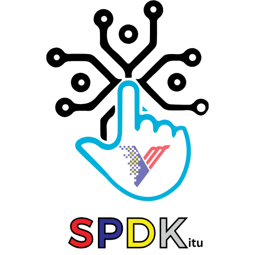

  
  
  # SPDK ITU
  ### Sistem Pendigitalan Data Kursus
  **Institut Teknologi Unggas (ITU), Jabatan Perkhidmatan Veterinar (DVS) Malaysia**

  
  
  

  **🌐 URL Portal: [kursusitu.github.io/spdk](https://kursusitu.github.io/spdk)**

---

## 📋 Tentang Sistem

SPDK ITU adalah **portal pengurusan kursus dalaman Institut Teknologi Unggas (ITU)** yang membolehkan pegawai mendaftar dan mengurus penyertaan kursus secara dalam talian. Sistem ini dibina menggunakan Google Apps Script (GAS) dengan Google Sheets sebagai pangkalan data.

---

## 🚀 Cara Akses

| Platform | Cara |
|---|---|
| **Desktop** | Layari [kursusitu.github.io/spdk](https://kursusitu.github.io/spdk) |
| **Mobile (Android)** | Layari URL → Menu (⋮) → Add to Home Screen |
| **Mobile (iOS)** | Layari URL → Share → Add to Home Screen |

> ℹ️ Hanya email `@dvs.gov.my` dan `@gmail.com` dibenarkan untuk pendaftaran akaun.

---

## 👥 Peranan Pengguna

| Peranan | Keupayaan |
|---|---|
| **Peserta** | Daftar akaun, log masuk, semak katalog kursus, daftar kursus, semak status pendaftaran, muat turun eCERT |
| **Admin** | Semua keupayaan peserta + urus kursus, urus pendaftaran, hantar surat tawaran, urus kehadiran & QR, maklum balas, laporan & statistik |
| **Superadmin** | Semua keupayaan admin + urus pengguna, tetapkan peranan |

---

## 📦 Modul Sistem

| Modul | Penerangan |
|---|---|
| 🔐 **Auth** | Log masuk, daftar akaun, lupa/reset kata laluan, log keluar |
| 📚 **Katalog Kursus** | Senarai kursus tersedia, carian, tapisan |
| 📝 **Pendaftaran** | Daftar kursus, semakan kuota, semak status |
| 📊 **Dashboard** | Ringkasan status pendaftaran, kursus aktif |
| 🏫 **Urus Kursus** | Tambah, kemaskini, padam kursus |
| ✅ **Urus Pendaftaran** | Lulus/tolak permohonan, bulk approve/reject |
| 📧 **Surat Tawaran** | Jana dan hantar surat tawaran via emel |
| 📷 **Kehadiran & QR** | Rekod kehadiran, jana QR code, scan QR |
| 💬 **Maklum Balas** | Borang maklum balas peserta, soalan dinamik |
| 🏆 **eCERT** | Auto-generate sijil digital, muat turun, verifikasi QR |
| 📈 **Laporan & Statistik** | Graf & carta, eksport Excel/PDF |
| 👤 **Profil** | Kemaskini maklumat peribadi, tukar kata laluan |
| 🔧 **Urus Pengguna** | Cipta, kemaskini, nyahaktif pengguna (Superadmin) |

---

## 🎨 Clay 3D Design System

Portal SPDK menggunakan tema **Clay 3D** — design language yang konsisten merentasi semua halaman:

| Elemen | Style |
|---|---|
| Background auth pages | `linear-gradient(145deg, #0d2b5e → #1a56db)` |
| Kad utama | `border-radius: 28px`, Clay 4-layer shadow |
| Button primary | Clay 3D gradient biru, press effect, `btnpop` animation |
| Input fields | `border-radius: 14px`, inset shadow, focus ring biru |
| SPDK dots | 4 warna: merah `#e63946`, biru `#1a56db`, kuning `#f4c430`, hijau `#2dc653` |
| Stat cards | `border-radius: 16px`, Clay shadow, `cardPop` animation |
| Counter | Rolling number animation dari 0 ke nilai sebenar |

**Halaman yang dah apply Clay 3D:**
- ✅ Login
- ✅ Daftar Akaun
- ✅ Dashboard Peserta
- ✅ Lupa Kata Laluan
- ✅ Reset Kata Laluan
- ✅ Panel Admin

---

## 📱 PWA (Progressive Web App)

Repo ini berfungsi sebagai **PWA shell** untuk SPDK ITU:

| Fail | Fungsi |
|---|---|
| `index.html` | PWA portal utama dengan route peserta, admin dan paparan eSijil |
| `manifest.json` | Metadata PWA (nama, icon, warna tema) |
| `sw.js` | Service Worker — offline fallback |
| `offline.html` | Halaman offline Clay 3D |
| `icon-192.png` | Icon app 192×192 |
| `icon-512.png` | Icon app 512×512 |

**Warna tema:** `#1a56db` (Biru DVS)

---

## eSijil Peserta PWA

Paparan eSijil peserta kini dikendalikan terus dalam PWA melalui route `#view-sijil?certId=...`.

Flow peserta:
1. Log masuk ke PWA.
2. Buka menu **Sijil Saya**.
3. Klik **Buka Sijil**.

Sijil penuh dipaparkan dalam PWA sendiri dan tidak lagi redirect ke GAS `page=sijil-saya`. Data sijil diambil melalui API `getSijilSaya`, kemudian sijil dicari berdasarkan `certId`.

Template sijil PWA menggunakan logic asal daripada GAS `SijilSaya.html`. Cetakan dan simpan PDF diset kepada A4 portrait. QR pengesahan sijil dipaparkan pada sijil dan membawa pengguna ke page pengesahan GAS `page=verify-cert&certId=...`.

Fix ini hanya melibatkan PWA dan tidak mengubah GAS/backend.

---

## 🛠️ Tech Stack

| Komponen | Teknologi |
|---|---|
| **Backend** | Google Apps Script (GAS) |
| **Frontend** | HTML + CSS + JavaScript |
| **Database** | Google Sheets |
| **Email** | GmailApp (`bukhori@dvs.gov.my`) |
| **Auth** | Custom session token (UUID) |
| **QR Code** | api.qrserver.com |
| **PWA Hosting** | GitHub Pages (`kursusitu/spdk`) |
| **Source Code** | GitHub (`BurnDVS/spdk-V1.5`) — private |

---

## 🔗 Repository Berkaitan

| Repo | Fungsi |
|---|---|
| [`kursusitu/spdk`](https://github.com/kursusitu/spdk) | PWA shell + short URL redirect (repo ini) |
| `BurnDVS/spdk-V1.5` | Source code GAS (private) |

---

## Changelog

### 2026-06-24

- Tambah route paparan sijil PWA.
- Betulkan print layout A4.
- Betulkan QR pengesahan sijil.

---

## 📞 Hubungi

**Pembangunan & Penyelenggaraan:**
Urusetia Kursus, Institut Teknologi Unggas (ITU)
Jabatan Perkhidmatan Veterinar Malaysia
📧 bukhori@dvs.gov.my

---

  © 2025 Institut Teknologi Unggas, Jabatan Perkhidmatan Veterinar Malaysia

